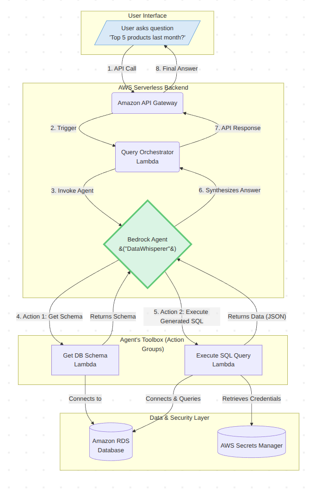
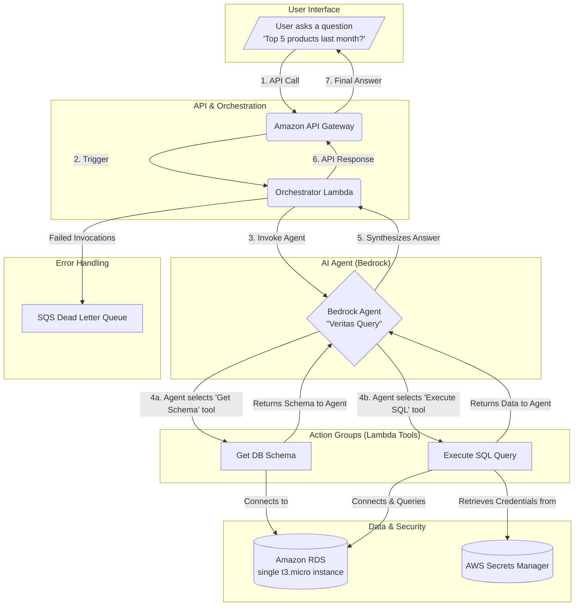

# Veritas Query

# Todo

- [x] Set up CI/CD with AWS CodeBuild and CodePipeline
- [x] Configure S3 bucket for static website hosting
- [x] Set up CloudFront distribution for CDN
- [x] Set up basic Lambda for API Gateway
- [x] Set up API Gateway
- [x] Call api gateway endpoint from the frontend
- [ ] Set up DynamoDB for database
- [ ] Use lambda to pull from DynamoDB
- [ ] Write to DynamoDB from the frontend

- [ ] Create query from user input
- [ ] Send query to lambda
- [ ] Set up Bedrock agent
- [ ] Call Bedrock agent from lambda with query
- [ ] Setup up api /generate and /execute endpoints
- [ ] Set api as Bedrock agent tools

**Veritas Query is a schema-aware Bedrock agent for generating accurate, transparent SQL from natural language.**

This project was developed for the AWS Agent Hackathon. It is a fully serverless, AI-powered analytics tool that allows non-technical users to query a relational database using plain English, with a core focus on architectural robustness, security, and user trust.



### Our Story: Building Veritas Query

Rossislike, a senior engineer, and I are alumni of the same cloud program. We saw the AWS Agent Hackathon as a chance to get our hands on the tech we're genuinely excited about—generative AI—and build something beyond the standard curriculum.

**What Inspired Us**

We wanted to tackle a problem we've both seen firsthand: the friction between a business user's question and an engineer's time. The whole process of ticketing and waiting for ad-hoc queries feels broken. Our goal was to build an agent that could act as a direct, natural language interface to a database.

But from day one, our primary design constraint was **trust**. An AI that gives a "magic" answer is useless in a business context. We needed to build a system whose reasoning was auditable.

**How We Built It**

We built the entire stack on serverless AWS. The core is a Bedrock Agent, but we architected it with a critical guardrail: the agent's master prompt forces it to follow a **two-step, schema-aware process**. Before it's allowed to generate a query, it _must_ call a `get_schema` Lambda to get the live database structure. This grounding in the source of truth is our main defense against the model hallucinating.

To close the loop on trust, we made the **"View Generated SQL"** button a first-class feature in the UI. This was non-negotiable. It turns the tool from a black box into a glass box, making it a powerful productivity multiplier for data analysts, not a threat.

**Challenges & What We Learned**

### Architecture Diagram


_(Note: This is a placeholder. You will need to generate a PNG of your Mermaid diagram and upload it to a host like Imgur, then replace this link.)_



````

### Core Technologies Used

**AI/ML:** Amazon Bedrock (Agents, Foundation Models)
**Compute:** AWS Lambda
**Database:** Amazon RDS (PostgreSQL)
**Networking:** Amazon VPC, Security Groups
**Security & Identity:** AWS IAM (Roles, Policies), AWS Secrets Manager
**API Layer:** Amazon API Gateway
**Observability:** Amazon CloudWatch (Logs), AWS X-Ray (Tracing)
**Version Control:** Git, GitHub
**Frontend:** Streamlit

### Project Plan

This project was developed in parallel tracks. IAM permissions were developed incrementally, alongside the components they secure.

**Track 1: Platform & Orchestration (Owner: Bash Cloud)**

Completed: Setup (Source Control), API Endpoint & Core Infrastructure, Orchestration Logic & Permissions.

**Track 2: Core Logic & User Interface (Owner: Ross Agginie)**

Completed: User Interface, Database & Action Group Lambdas.

**Track 3: Integration & AI (Owner: Both)**

Completed: Agent Configuration & Permissions, Full End-to-End Testing.

### Getting Started

#### Prerequisites

- AWS CLI configured
- AWS SAM CLI (or Terraform) installed
- Python 3.11+
- Git

#### Deployment

1.  Clone the repository:
    ```bash
    git clone https://github.com/BashiM1/veritas-query.git
    cd veritas-query
    ```
2.  Build the serverless application:
    ```bash
    sam build
    ```
3.  Deploy the stack to your AWS account:
    ```bash
    sam deploy --guided
    ```
    _(Follow the prompts to provide a stack name and region.)_

#### Running the UI

1.  Navigate to the UI directory: `cd ui`
2.  Install the required packages: `pip install -r requirements.txt`
3.  Run the Streamlit application (ensure you configure the API endpoint in `app.py`):
    ```bash
    streamlit run app.py
    ```

### Architectural Decision Records (ADRs)

For a deeper insight into our design choices, please see the Architectural Decision Records located in the `/docs/adr` directory. These documents capture the "why" behind key decisions, such as our choice of database and our agile approach to IAM development.

```# veritas-query

```
````
